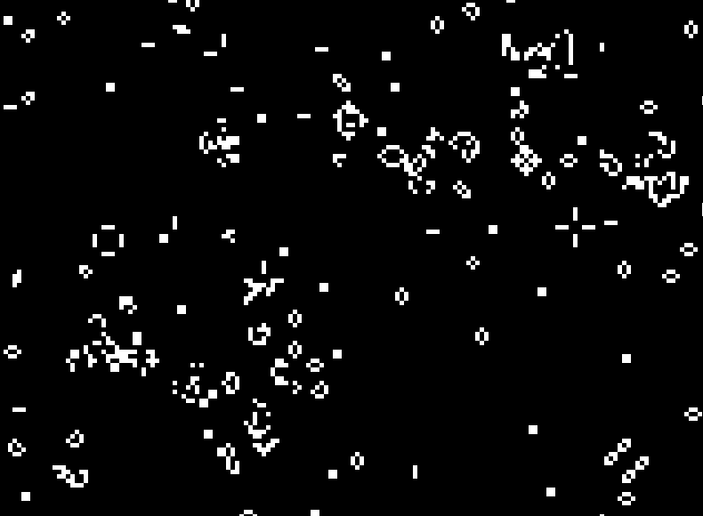

# Conway's Game of Life

Conway's Game of Life is considered a zero player game consisting of a grid of cells that have only two possible states: alive or dead.

As the game goes on, a cell's state changes if it matches certain criteria.

- A cell dies if it has fewer than 2 alive neighbors or more than 3 neighbors.
- A cell remains alive if it has only 2-3 alive neighbors.
- A cell comes back to life if it has _exactly_ 3 alive neighbors.

Run the makefile, then run ./game to view

Escape Key or the X button in the top right corner exits the game

